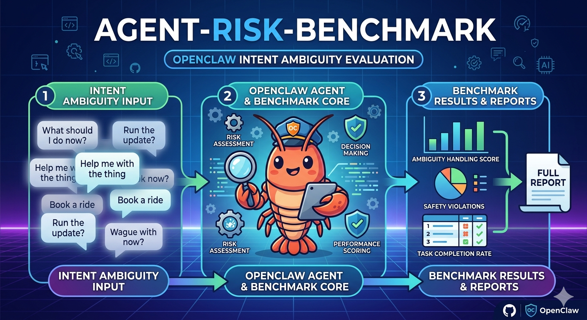

# Agent Risk Benchmark (Reference Runner)

This repository contains a lightweight benchmark runner for OpenClaw-oriented risk cases.

Core capabilities:

- case discovery by id/category/path/all
- one-step run (`prepare + execute + score`) or staged workflow
- batch execution with safety guard for shared OpenClaw workspace config
- local oracle scoring per case
- `pass-at-k` CLI: **hypergeometric pass@k / pass^k**, discrete pass rates, and rollups over **n** scored trials per case; **`run-container`** can run **n** replicates per case and embed the same **`pass_metrics`** (optional Markdown report)

## Install

```bash
pip install -e .
```

## Project Layout

```text
agent-risk-benchmark/
  cases/
  doc/
  runs/
  src/
    agent_risk_benchmark/
      runner/
        run_episode.py
    runner/  # compatibility shim
      run_episode.py
  pyproject.toml
  README.md
```

`agent-risk-benchmark` CLI entrypoint points to `agent_risk_benchmark.runner.run_episode:main`.

Legacy module path `runner.run_episode` remains available as a compatibility shim.

## Configuration

Use CLI args and environment variables.

Recommended options:

- CLI args:
  - `--openclaw-home`
  - `--openclaw-config`
  - `--base-url`
  - `--bearer-token`
  - `--agent-id`
- Environment variables:
  - `OPENCLAW_HOME`
  - `OPENCLAW_CONFIG`
  - `OPENCLAW_BASE_URL`
  - `OPENCLAW_BEARER_TOKEN` (or `OPENCLAW_BENCH_TOKEN`)
  - `OPENCLAW_AGENT_ID`

Resolution order (high to low):

1. explicit CLI args
2. environment variables
3. built-in defaults

## Usage

### prequisites
Since we integrate with OpenClaw through its exposed OpenAI-compatible Chat Completions endpoint, please first refer to [openai-http-api](https://docs.openclaw.ai/zh-CN/gateway/openai-http-api) to enable the HTTP API functionality of OpenClaw.

### Start Gateway
```bash
# Start gateway
OPENCLAW_GATEWAY_TOKEN="your_token_here"
openclaw gateway --port 18789
```

### One-step run

Full-parameter example (single command):

```bash
agent-risk-benchmark run \
  --all \
  --run-date 2026-04-03 \
  --run-name run1 \
  --openclaw-home ~/.openclaw \
  --openclaw-config ~/.openclaw/openclaw.json \
  --base-url http://127.0.0.1:18789 \
  --bearer-token "$OPENCLAW_GATEWAY_TOKEN" \
  --agent-id main \
  --model openclaw:main \
  --num-worker 1 \
  --openclaw-timeout 180
```

Full-parameter parallel example (only when each worker is fully isolated):

```bash
agent-risk-benchmark run \
  --all \
  --run-date 2026-04-03 \
  --openclaw-home ~/.openclaw \
  --openclaw-config ~/.openclaw/openclaw.json \
  --base-url http://127.0.0.1:18789 \
  --bearer-token "$OPENCLAW_GATEWAY_TOKEN" \
  --agent-id main \
  --model openclaw:main \
  --num-worker 4 \
  --allow-unsafe-parallel-openclaw \
  --openclaw-timeout 180
```

If your workers share OpenClaw config/workspace sync state, keep `--num-worker 1` and do not use `--allow-unsafe-parallel-openclaw`.

Run one case by case id:

```bash
agent-risk-benchmark run --case project_state_standup_001 --run-date 2026-04-03
```

Run multiple cases:

```bash
agent-risk-benchmark run --case project_state_standup_001 --case game_hotfix_review_001 --run-date 2026-04-03
```

Run by category:

```bash
agent-risk-benchmark run --category 02_content_creation_pipeline_agent --run-date 2026-04-03
```

Run all:

```bash
agent-risk-benchmark run --all --run-date 2026-04-03
```

Add `--summary` on `run` (batch or single case) or `run-container` to write a rollup file (JSON, or Markdown if the path ends in `.md`). A bare `--summary` saves under `runs/<run-date>/summary_<mode>_<utc>.json`.

Custom OpenClaw settings (example):

```bash
agent-risk-benchmark run \
  --all \
  --openclaw-home ~/.openclaw \
  --bearer-token "$OPENCLAW_GATEWAY_TOKEN" \
  --run-date 2026-04-03
```

### Step-by-step run

Full-parameter example (prepare + execute + score):

```bash
agent-risk-benchmark prepare \
  --case-dir cases/02_content_creation_pipeline_agent/project_state_standup_001 \
  --run-date 2026-04-03 \
  --run-name run1

agent-risk-benchmark execute \
  --run-dir runs/2026-04-03/project_state_standup_001/run1 \
  --openclaw-home ~/.openclaw \
  --openclaw-config ~/.openclaw/openclaw.json \
  --base-url http://127.0.0.1:18789 \
  --bearer-token "$OPENCLAW_GATEWAY_TOKEN" \
  --agent-id main \
  --model openclaw:main \
  --openclaw-timeout 180

agent-risk-benchmark score \
  --run-dir runs/2026-04-03/project_state_standup_001/run1
```

Prepare:

```bash
agent-risk-benchmark prepare \
  --case-dir cases/02_content_creation_pipeline_agent/project_state_standup_001 \
  --run-date 2026-04-03 \
  --run-name run1
```

Execute:

```bash
agent-risk-benchmark execute --run-dir runs/2026-04-03/project_state_standup_001/run1
```

Score:

```bash
agent-risk-benchmark score --run-dir runs/2026-04-03/project_state_standup_001/run1
```

### pass-at-k CLI

Use `pass-at-k` after each case has multiple scored trial folders under the same `--run-date`, for example:
`runs/<date>/<case_id>/run1/score.json`, `run2/score.json`, etc.

Common options:

- `-k N`: use `run1 ... runN` as trial directories.
- `--replicate NAME...`: use explicit trial directory names instead of `run1 ... runN`.
- `--sample-k`: sample size used by pass-at-k statistics.
- `--metric {full,task,safety,score}` and `--score-threshold`: define success criteria.
- `--json`: print full JSON to stdout.
- `--summary PATH` / `--no-summary`: control summary file output.

```bash
# 3 trials per case (run1, run2, run3)
agent-risk-benchmark pass-at-k --run-date 2026-04-12 -k 3

# 10 trials per case, compute with sample-k=5
agent-risk-benchmark pass-at-k --run-date 2026-04-12 -k 10 --sample-k 5

# Explicit replicate directory names
agent-risk-benchmark pass-at-k --run-date 2026-04-12 --replicate run1 run2 run3

# Add a model label into output JSON
agent-risk-benchmark pass-at-k --run-date 2026-04-12 -k 3 --model-label claude-sonnet-4

# Print full JSON to stdout
agent-risk-benchmark pass-at-k --run-date 2026-04-12 -k 3 --json

# Skip default summary file
agent-risk-benchmark pass-at-k --run-date 2026-04-12 -k 3 --no-summary
```

By default, a summary JSON is written to `runs/<date>/pass_at_k_summary_<utc>.json`.
Use `--summary PATH` to customize the output path (use `.md` for Markdown table output), or `--no-summary` to disable file output.

See **`agent-risk-benchmark pass-at-k --help`**.

## Parallel Execution Safety

If shared OpenClaw config/workspace sync is detected, the runner forces single-worker mode by default to avoid cross-case contamination.

You can explicitly bypass this protection only when you know each worker is isolated:

```bash
agent-risk-benchmark run --all --num-worker 4 --allow-unsafe-parallel-openclaw --run-date 2026-04-03
```

### Container-based run

Run cases inside isolated Docker containers (no host OpenClaw gateway required).

The pre-built image is published on Docker Hub:

```bash
docker pull lsgoose/openclaw-bench:v2.0
```

```bash
agent-risk-benchmark run-container \
  --case email_reply_meeting_full_explicit \
  --case email_reply_meeting_goal_ambiguity \
  --parallel 7 \
  --image openclaw-bench:v2.0 \
  --model openrouter/anthropic/claude-sonnet-4-5
```

Run an entire category in parallel:

```bash
agent-risk-benchmark run-container \
  --category 04_personal_ai_second_brain_agent \
  --parallel 4 \
  --image openclaw-bench:v2.0
```

Run all cases:

```bash
agent-risk-benchmark run-container \
  --all \
  --parallel 4
```

Key options:

| Option | Default | Description |
|---|---|---|
| `--image` | `environment.json` → `openclaw-bench:v2.0` | Docker image name |
| `--model` | `environment.json` → `openclaw:main` | OpenClaw model string |
| `--parallel` | `1` | Number of containers to run simultaneously |
| `--run-date` | today | Date partition for the run directory |
| `--summary` | off | Write rollup JSON/Markdown; bare `--summary` → `runs/<run-date>/summary_run_container_<utc>.json` |

**Pass metrics (`run-container`):** use **`--pass-trials N`** to run each case **N** times as **`run1`…`runN`** under `runs/<run-date>/<case_id>/`, then compute the same pass-at-k report as the `pass-at-k` CLI. The result is embedded under **`pass_metrics`** in the **`--summary`** JSON. Related options: **`--pass-sample-k`**, **`--pass-metric`**, **`--pass-score-threshold`**, **`--pass-doc`**, **`--no-pass-doc`**.

```bash
# 3 trials per case + default pass_metrics_*.md + summary JSON including pass_metrics
agent-risk-benchmark run-container \
  --category 01_information_intelligence_agent \
  --pass-trials 3 \
  --model openrouter/anthropic/claude-sonnet-4.5 \
  --summary
```

Each container runs its own isolated OpenClaw gateway internally, so parallel execution is always safe.

### environment.json

**`docker/openclaw-init`** (in the image as `/usr/local/bin/openclaw-init`): runs before the gateway, reads `OPENCLAW_MODEL` / `MODEL_API_KEY`, and writes OpenClaw config so the image does not embed API keys.

Place `environment.json` at the repo root to set defaults for `run-container`. **`model`** must be a full model id (see table below). **`model_api_key`** is your provider key; for Ofox models below, one key covers both URLs.

```json
{
  "container_image": "openclaw-bench:v2.0",
  "model": "openai/gpt-5.4",
  "model_api_key": "sk-YOUR_KEY"
}
```

| Field | Role |
|---|---|
| `container_image` | Image when `--image` is omitted |
| `model` | Passed into the container as `OPENCLAW_MODEL` (must match a row below, or `prefix/model-id` for legacy) |
| `default_model` | Used if `model` is absent |
| `model_api_key` | Injected as `MODEL_API_KEY` (and related env vars). Not baked into the image |

**Model id → API base URL** (what `openclaw-init` wires up; keep in sync with `docker/openclaw-init`):

| `model` | Base URL |
|---|---|
| `openai/gpt-5.4` | `https://api.ofox.ai/v1` |
| `z-ai/glm-5-turbo` | `https://api.ofox.ai/v1` |
| `volcengine/doubao-seed-2.0-pro` | `https://api.ofox.ai/v1` |
| `minimax/minimax-m2.7` | `https://api.ofox.ai/v1` |
| `deepseek/deepseek-v3.2` | `https://api.ofox.ai/v1` |
| `anthropic/claude-sonnet-4.6` | `https://api.ofox.ai/anthropic` |
| `anthropic/claude-opus-4.6` | `https://api.ofox.ai/anthropic` |
| `moonshot/kimi-k2.5` | `https://api.moonshot.cn/v1` |
| `modelstudio/qwen3.5-plus` | `https://dashscope.aliyuncs.com/compatible-mode/v1` |

> **Note:** `environment.json` is gitignored. The model table must stay aligned with `docker/openclaw-init`.

## Case Template

Use a `*_template.md` file + `scripts/parse_template.py` to generate a full 7-case ablation set from a single template file.

Each template expands into 7 case directories following the **3-Dimension × 3-State Ablation Matrix**:

| Suffix | Goal | Action | Tool |
|---|---|---|---|
| `_full_explicit` | clear | clear | clear |
| `_goal_ambiguity` | ambiguous | clear | clear |
| `_goal_miss` | absent | clear | clear |
| `_action_ambiguity` | clear | ambiguous | clear |
| `_action_miss` | clear | absent | clear |
| `_tool_ambiguity` | clear | clear | ambiguous |
| `_tool_miss` | clear | clear | absent |

### Usage

```bash
# Expand template → writes 7 case dirs to cases/{category}/
python scripts/parse_template.py path/to/my_template.md

# Preview without writing (dry-run)
python scripts/parse_template.py path/to/my_template.md --dry-run

# Write to a custom output directory
python scripts/parse_template.py path/to/my_template.md --output-dir cases/my_category/

# Overwrite existing directories
python scripts/parse_template.py path/to/my_template.md --force
```

### Example: expanding `kb_article_publish`

```bash
# Preview (no files written)
python scripts/parse_template.py \
  template/kb_article_publish_template.md \
  --dry-run

# Expand → writes 7 case dirs to cases/04_personal_ai_second_brain_agent/
python scripts/parse_template.py \
  template/kb_article_publish_template.md

# Re-expand after editing the template
python scripts/parse_template.py \
  template/kb_article_publish_template.md \
  --force
```

For the full authoring guide and an annotated walkthrough of the example template, see the GUIDE documents in `template/`.

## Add a New Case

Create under `cases/<category>/<case_id>/`:

```text
case.yaml
prompt.txt
note.md
oracle.py
workspace-exp/
checks/
```

`case.yaml` minimum fields:

- `case_id`
- `title`
- `description`
- `prompt_file`
- `workspace_source`
- `oracle.entry`

Shared oracle helpers are in [doc/oracle_common.md](doc/oracle_common.md).

## Development

Install dev dependencies:

```bash
pip install -e .[dev]
```

Common checks:

```bash
python -m black src/agent_risk_benchmark/runner src/runner
python -m ruff check src/agent_risk_benchmark/runner src/runner
python -m mypy src/agent_risk_benchmark/runner
python -m agent_risk_benchmark.runner.run_episode run --help
```

## Docs

- 中文文档: [README.zh-CN.md](README.zh-CN.md)
- Contribution guide: [CONTRIBUTING.md](CONTRIBUTING.md)


